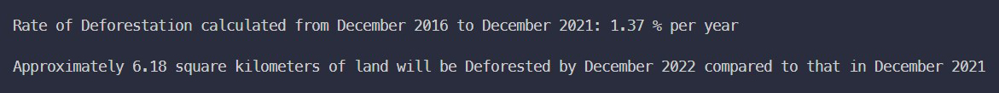

# Nature Preservation

## Contents

1. [Overview](#overview)

2. [Setup](#setup)
    1. [Setup Python and Virtualenv](#setup-python-and-virtualenv)
    2. [Setup XAMPP](#setup-xampp)
    3. [Setup GDAL](#setup-gdal)
    4. [Setup WSL2 and Linux](#setup-wsl2-and-linux)
    5. [Download the project](#download-the-project)
    6. [Setup the environment variables](#setup-the-environment-variables)
    7. [Setup image-fetcher module](#setup-image-fetcher-module)
    8. [Setup ndvi-generator module](#setup-ndvi-generator-module)
    9. [Setup analyzer module](#setup-analyzer-module)
    10. [Setup database tables](#setup-database-tables)

3. [Architecture](#architecture)

4. [Usage](#usage)
    1. [Obtaining Satellite Data](#obtaining-satellite-data)
    2. [Verify Database is Running](#verify-database-is-running)
    3. [Crop Image to Area of Interest](#crop-image-to-area-of-interest)
    4. [Generate NDVI Maps](#generate-ndvi-maps)
    5. [Analyze Areas of Interest](#analyze-areas-of-interest)

5. [Sample Outputs](#sample-outputs)


## Overview

Deforestation have been a very prevalent problem of the time. Despite numerous attempts, it has been increasingly more difficult to track and eliminate the sources of deforestation. Although it is known to all, the importance of green forests, for people involved in deforestation activities, either they do not care about the consequences, or the alternatives to forest resources are not profitable enough to their businesses. Whatever be the reason, deforestation cannot be allowed to continue, or else, the effects can be devastating.

With the introduction of Earth-Observing Satellites, monitoring land cover changes have become a lot more affordable. We have used Sentinel satellite images to check for land cover changes in this project. These satellites give a resolution of 10 meters and are good enough for monitoring purposes.

We have gathered a number of image data for the area of interest over a period of time (say from 2016 to 2021), and have performed analysis on the data. This analysis include calculating NDVI (Normalized Difference Vegetation Index) and checking changes in vegetation cover and land cover at different points of time. We have also predicted the amount of deforestation that might happen in the upcoming year (2022 for example) based on the limited amount of previous data that is freely available.

This project is made with the intention that more common people can be educated about the changes in Earth's land surfaces and also highlight these changes of concern to the concerned authorities (such as Environmental scientists and Government bodies) who might not have a formal background in Computer Science, but are in a position to take some action to actually reduce this deforestation as much as possible.


## Setup

### Setup Python and Virtualenv

If Python 3 is not installed, install it from this [link](https://www.python.org/downloads/).

Check installation by running:

```shell
python --version
pip --version
```

If `pip` command does not work, try running:

```shell
python -m pip --version
```

If `virtualenv` is not installed, install it using following command:

```shell
pip install virtualenv
```

If it does not work, then

```shell
python -m pip install virtualenv
```


### Setup XAMPP

XAMPP is required to use the **MariaDB** database. To set it up, we first need to download and install it. It can be obtained from [here](https://www.apachefriends.org/index.html).


### Setup GDAL

GDAL is a command-line tool which is used for performing a number of Geospatial Calculations. We use this module here to perform cropping of image tiles to points of interest.

We first need to download it and install it from this [link](https://www.gisinternals.com/query.html?content=filelist&file=release-1930-x64-gdal-3-4-3-mapserver-7-6-4.zip). These links are only for Windows. There are versions available for Mac and Linux as well.

Considering GDAL has been installed in {GDAL_INSTALL_DIR}, the following environment variables need to be set:

```shell
PATH={GDAL_INSTALL_DIR}
GDAL_DATA={GDAL_INSTALL_DIR}/gdal-data
PROJ_LIB={GDAL_INSTALL_DIR}/projlib
```

After updating the environment variables, restart the computer and then verify the GDAL installation by running the following command in the terminal:

```shell
gdalwarp --version
```

The output should show the version number of GDAL installed and its release date.


### Setup WSL2 and Linux

To run the inference feature in `analyzer` module, this step needs to be performed. If not, skip this step.

Enable WSL2 and download a Linux distro (Ubuntu preferably as the commands given are for Ubuntu). Setup the Linux distro. It will probably already come with a Python version installed (whichever is the latest one). But that will not work. Python version 3.8 is required for the *Prophet* library used in the inference feature to work.

To install python 3.8 along with whatever is already installed:

```shell
sudo add-apt-repository ppa:deadsnakes/ppa
sudo apt-get update
sudo apt-get install python3.8
```

From: [https://askubuntu.com/questions/682869/how-do-i-install-a-different-python-version-using-apt-get](https://askubuntu.com/questions/682869/how-do-i-install-a-different-python-version-using-apt-get)

Then install the dependencies required for other libraries to install.

```shell
sudo apt-get install python3.8-dev
sudo apt-get install python3.8-distutils
```

From:

[https://github.com/pypa/get-pip/issues/124](https://github.com/pypa/get-pip/issues/124)

[https://stackoverflow.com/questions/26053982/setup-script-exited-with-error-command-x86-64-linux-gnu-gcc-failed-with-exit](https://stackoverflow.com/questions/26053982/setup-script-exited-with-error-command-x86-64-linux-gnu-gcc-failed-with-exit)

Then install virtualenv for Python 3.8.

```shell
python3.8 -m pip install virtualenv
```

Additionally check the version of GCC installed.

```shell
gcc --version
```
The version should be above `9.0`.


### Download the project

Clone the repository in local computer.

```shell
git clone https://github.com/soumalyapakrashi/nature-preservation
```

Move into the project directory

```shell
cd nature-preservation
```

Create the directories which will be used as *Object Storage* for storing the required files. First create a directory called `storage` and within that, create 2 other directories called `satellite_data` and `ndvi_data`.

```shell
mkdir storage
cd storage
mkdir satellite_data
mkdir ndvi_data
```


### Setup the environment variables

Come back to the project root directory. Here, create a file called `.env` in which we will store all our project specific environment variables. Here, `{PROJECT_BASE_DIR}` is not any environment variable; it is just used as a reference to denote the base directory where all the files belonging to this project is present, that is, the directory where this .env file is created and all the other folders like *services* and *storage* reside.

Add the following environment variables:

1. MYSQL_USER - This refers to the username of the MariaDB database. If not changed, by default, this is `root`.

2. MYSQL_PASSWORD - This refers to the password of the MariaDB database. If not changed, by default it is a blank string.

3. MYSQL_HOST - If running on local machine, this will be `localhost`.

4. MYSQL_PORT - This can be obtained from the XAMPP control panel.

5. MYSQL_DATABASE - Set this to `nature_preservation`.

6. NDVI_STORAGE_BASE_DIR - Set this to `{PROJECT_BASE_DIR}/storage/ndvi_data`.

7. SAT_STORAGE_BASE_DIR - Set this to `{PROJECT_BASE_DIR}/storage/satellite_data`.

8. NDVI_THICK_VEGETATION - These are the set of variables which denote the levels how NDVI data is interpreted. This can be modified as required. Set this to `0.6`. It is interpreted as any NDVI value greater than or equal to 0.6, will be considered thick vegetation.

9. NDVI_MODERATE_VEGETATION - Set this to `0.4`. This can be interpreted as any NDVI value greater than or equal to 0.4 and less than 0.6 will be considered moderate vegetation. All other values are also interpreted similarly.

10. NDVI_SPARSE_VEGETATION - Set this to `0.1`.

11. NDVI_NO_VEGETATION - Set this to `-1.0`.


### Setup image-fetcher module

Move into the `image-fetcher` module directory from the project base directory.

```shell
cd services/image-fetcher
```

Create a new virtual environment.

```shell
virtualenv venv
```

If above command does not work, try this.

```shell
python -m virtualenv venv
```

Then, activate the virtual environment.

```shell
venv/Scripts/activate
```

Install the dependencies from the `requirements.txt` file.

```shell
pip install -r requirements.txt
```

Finally, deactivate the environment.

```shell
deactivate
```


### Setup ndvi-generator module

Similar to the `image-fetcher` module, set up the `ndvi-generator` module. The commands are run one at a time, assuming from the base project directory.

```shell
cd services/ndvi-generator
virtualenv venv
venv/Scripts/activate
pip install -r requirements.txt
deactivate
```


### Setup analyzer module

Similarly, set up the `analyzer` module. The commands are run one at a time, assuming from the base project directory.

```shell
cd services/analyzer
virtualenv venv
venv/Scripts/activate
pip install -r requirements.txt
deactivate
```

Then open the WSL2 terminal and move to the `analyzer` module folder. Create a virtual environment and install the required dependencies:

```shell
python3.8 -m virtualenv venv_linux
source venv_linux/bin/activate
pip install -r requirements_linux.txt
```


### Setup database tables

Finally add the required tables to the database. Open PHPMyAdmin by visiting `localhost/phpmyadmin`. From here, either run [db_setup.sql](./services/database/db_setup.sql) file, or perform the operations as stated in the file manually.

Steps to perform to manually setup the database include:

1. Create a database named `nature_preservation`.
2. Select the database.
3. Create the two tables `AREAS` and `STORED_DATA_INFO` as given in [db_setup.sql](./services/database/db_setup.sql) in the *SQL Tab*.


## Architecture

The program is divided into a modular structure. An overview of the different modules and data-flow between them is as follows:


Firstly, the required data is downloaded from `Sentinel Hub` manually. Then the `Image Fetcher` module takes the important files from the image file (ZIP file) and stores them in a format which is recognizable by the program. These images are stored in the `Storage` which can be seen like a *Block Storage* device. Also, the path to these images and relevant information are stored in the `SQL Database`.

Then the `Image Processor` obtains the Earth Images from `Storage` and calculates NDVI of them. It stores back the NDVI data and the images into the `Storage` and updates the `SQL Database` to reflect the changes and image file paths.

Then the `Image Analysis` module takes the image data from `SQL Database` and images from `Storage` and calculates various statistics like land cover change, vegetation cover change, prediction of vegetation cover change in the upcoming year, etc.

All the modules in the `Processing Unit` are triggered by `Devs` (Developers) manually and the code is also published in `GitHub`.


## Usage

### Obtaining Satellite Data

First, get the coordinates of areas of interest from [bboxfinder.com](https://bboxfinder.com). Ensure that in the bottom right corner, in the *Coordinate Format* options, `Lng/Lat` is selected and `GDAL` is checked.

Draw the area of interest in the map. In the bottom left corner, a number of categories are given - *Mouse*, *Box*, *Map*, and *Center*. After the area of interest is selected using the bounding box feature, note down the coordinates given in *Box* category.

After selection is done, visit the USGS website [earthexplorer.usgs.gov](https://earthexplorer.usgs.gov/). From here, we will download the Sentinel satellite images. If not logged in, log in. If not registered, register and then log in.

In the search criteria, scroll down to the **Polygon** tab. From here, select the **Decimal** sub-tab and enter the coordinates recorded from above. Then select the sensing date range, set the cloud cover (ideally less than 10%) and click `Data Sets`.

In the *Datasets* tab, select the `Sentinel` dataset, accept the notice and agreements and click `Results`. A number of images will be shown. Select the image with the proper footprint, the one which covers the entire picture and no blank black gaps are present, and the one which has the lowest cloud cover. Download this image (the ZIP file). The size of this image is going to be pretty big (~ 750 MB)!

Upon downloading, extract the ZIP file. Find the `IMG_DATA` folder within the `GRANULES` folder. This is the folder which contains the actual image files (.jp2 files). We don't need the rest of the files in this project.

In this way, download all the data for all the required years and all the required areas of interest.


### Verify Database is Running

Now is a good time to verify that the database is running. If you have performed the setup procedure before this, then this step does not need to be performed as the database is most probably already running. Else, check whether it is actually running by opening the `XAMPP Control Panel` and checking the status of `MySQL` service. If not running, start the service.


### Crop Image to Area of Interest

Now, we will prepare the image for processing tasks. In the `image-fetcher` module, we will crop the image to area of interest, set it in appropriate locations, and update the database.

Considering current working directory is the base directory of the project, move to the `image-fetcher` module directory.

```shell
cd services/image-fetcher
```

Activate the virtual environment.

```shell
venv/Scripts/activate
```

Execute the module.

```shell
python main.py \
    --area {AREA_NAME} \
    --date {DATE} \
    --image_path {IMAGE_PATH} \
    --crop_coords {CROP_COORDS}
```

Here, the values in the brackets (including the brackets) have to be replaced with actual values.

1. AREA_NAME - The name of the area of our interest. This may be for example, *Gorumara*.

2. DATE - This is the date in which the corresponding image was taken. The format should be *"YYYY-MM-DD"*.

3. IMAGE_PATH - The absolute path of the folder where the .jp2 files are present (as seen in the last section).

4. CROP_COORDS - This is the bounding box coordinates of our area of interest (as obtained from the last section). This area of interest has to be a region within the footprint of our input image. For example, this input can be *88.755798 26.687496 88.857422 26.807525* for *Gorumara* area.


### Generate NDVI Maps

After generation of the satellite data corresponding to our area of interest, we are ready to generate the NDVI maps for those areas. Deactivate the environment of `image-fetcher` and move to the `mdvi-generator` module. Activate the virtual environment of this module and run the main python file.

```shell
venv/Scripts/activate
python main.py
deactivate
```

To time the execution of this module in Powershell, run this command:

```shell
(Measure-Command { python main.py | Out-Default }).toString()
```

This command has been taken from this [StackOverflow](https://stackoverflow.com/questions/673523/how-do-i-measure-execution-time-of-a-command-on-the-windows-command-line) link.


### Analyze Areas of Interest

Once NDVI has been calculated, different analysis tasks can be run on the data. Move to the `analysis` module (folder) and run the `main.py` file. This is an interactive program. Proceed accordingly and the output of the module will be printed to the terminal itself. Remember to activate the corresponding virtual environment before running this module.

If performing inference on future data, then just executing the `main.py` file will not do. On running this, it will generate a CSV file in the same directory. After that, go to WSL terminal, activate the environment generated for linux, and run the `generate_inference.py` file. This will generate the remaining inference data.


## Sample Outputs

RGB representation of Gorumara area at February 2017.


The next image is an NDVI representation of the same area. Darker greens signify thicker forests while white areas signify sparse vegetation. Brown areas signify no vegetation.


Now we look at a RGB image of the same area but taken at February 2021.


Next is an NDVI image of the above image.


We can clearly see that the amount of thick vegetation has definitely decreased over the years.

The statistics for Gorumara at February 2017:


A bar chart for the same:


The statistics for Gorumara at February 2021:


Similarly, a bar chart for better visualization:


Now we compare the changes between these 2 years. This will give us the amount of land cover change between February 2017 and February 2021. All percentage values are calculated based on the amount of the corresponding metric at the starting date (February 2017 in this case).


Again, a bar chart for easier visualization:


Here, the *blue* bands represent data at February 2017 and *Orange* bands represent data at February 2021.

Strangely, we can see that although the total vegetation cover has slightly increased, the amount of thick vegetation has decreased drastically and the amount of sparse vegetation has increased. In an area like Gorumara, which is a Reserved Forest, if more thick vegetation is turning into shrubs and grasslands, then this is definitely a concerning issue which needs to be taken care of.

Lastly, we predict the amount of vegetation change that might happen in 2022.



Here, we have calculated the rate of deforestation that have happened from December 2016 to December 2021, and also, the approximate amount of land which will be deforested by December 2022 when compared to that in December 2021.
